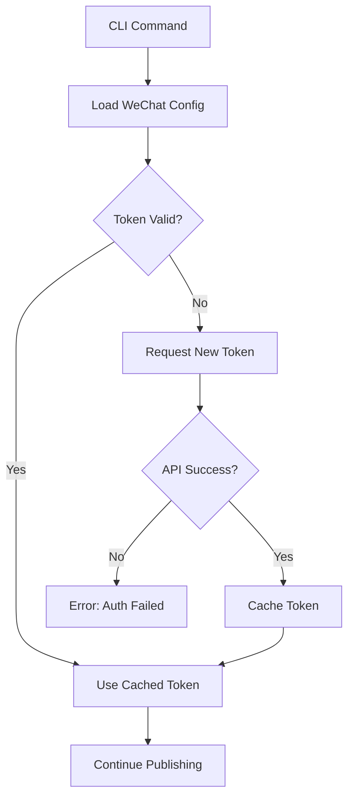
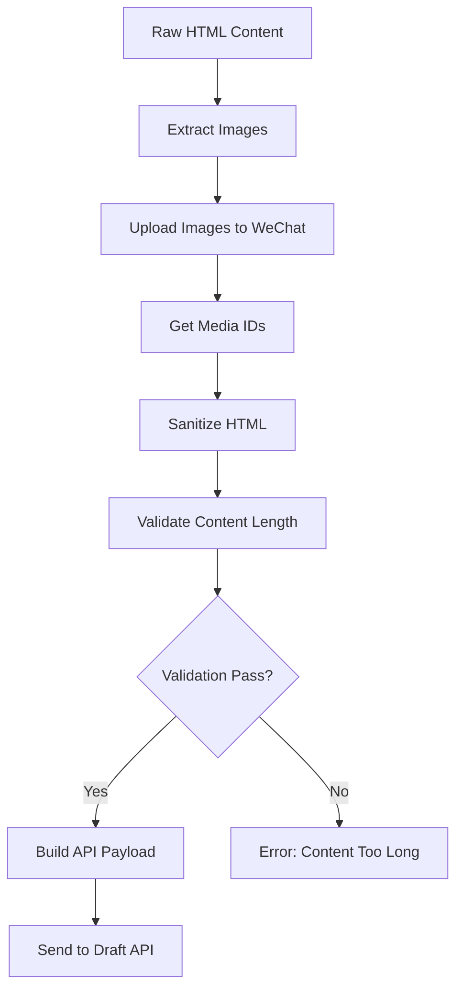
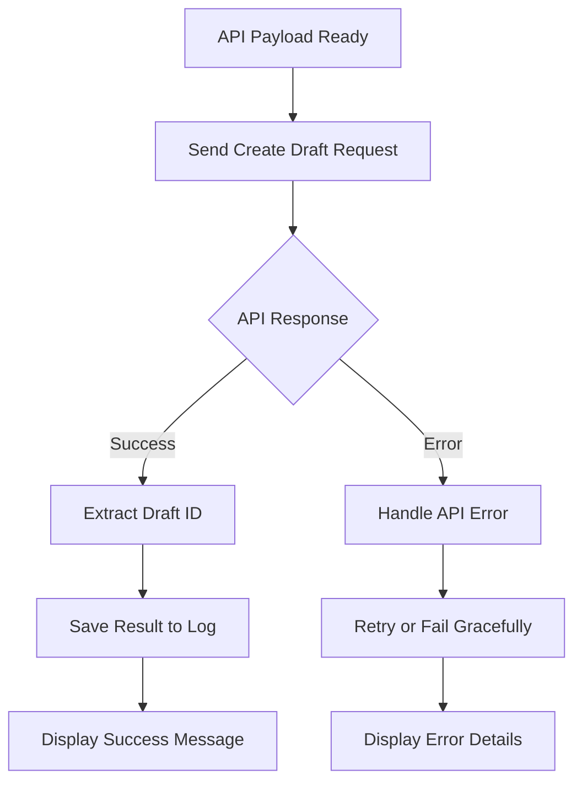

# Project Specification Document (PSD)
## VPSWeb Directory-Based Publishing System

**Document Status**: Draft v1.0
**Created**: 2025-10-13
**Target Version**: v0.2.5
**Author**: VPSWeb Development Team

---

## 🎯 Executive Summary

This PSD defines the implementation of a simple, clean directory-based publishing system for VPSWeb that replaces the current metadata.json-based CLI interface. The new system will publish WeChat articles from directories containing `article.html` and `metadata.json` files, leveraging high-quality LLM-generated digests.

**Key Change**: Replace `vpsweb publish-article --article metadata.json` with `vpsweb publish-article --directory <path>`

---

## 📋 Project Context

### Current State
- VPSWeb has basic WeChat article generation functionality
- Current CLI requires passing `metadata.json` file path
- Article discovery logic is confusing (metadata.json → article.html)
- Import errors prevent testing (article_generator import issue)
- LLM-generated digests are available in metadata.json but not optimally utilized

### Problem Statement
Users expect to publish from article directories, not metadata files. The current two-step approach (find metadata → load HTML) is unintuitive and doesn't match natural user workflows.

### Solution Overview
Implement directory-based publishing that discovers `article.html` + `metadata.json` pairs automatically, validates files, extracts LLM-generated content, and publishes to WeChat drafts.

---

## 🎯 Project Goals

### Primary Goals
1. **Simplify CLI Interface**: Single `--directory` option replaces complex file-based approach
2. **Leverage LLM Digests**: Use high-quality digests from metadata.json
3. **Improve User Experience**: Natural directory-based workflow
4. **Maintain Quality**: Robust validation and error handling

### Success Criteria
- ✅ CLI accepts only `--directory` option
- ✅ Successfully discovers and validates `article.html` + `metadata.json` pairs
- ✅ Extracts LLM-generated digest from metadata.json
- ✅ Publishes articles to WeChat drafts successfully
- ✅ Provides clear error messages for validation failures
- ✅ Works with dry-run mode for testing

---

## 🔧 Technical Requirements

### Functional Requirements

#### CLI Interface
- **Command**: `vpsweb publish-article --directory <path> [--dry-run] [--verbose]`
- **Required Option**: `--directory` (Path to article directory)
- **Optional Options**: `--dry-run` (Preview without API calls), `--verbose` (Detailed logging)
- **Removal**: Remove existing `--article` option completely

#### File Discovery System
- **Validation**: Directory must contain both `article.html` and `metadata.json`
- **File Structure**:
  ```
  <directory>/
  ├── article.html              # Main content (required)
  └── metadata.json             # LLM digest + metadata (required)
  ```
- **Required Fields**: `metadata.json` must contain `title` and `digest` fields
- **Optional Fields**: `author`, `poem_title`, `poet_name`, `source_lang`, `target_lang`

#### Metadata Extraction
- **Title**: Extract from `metadata.json.title`
- **Digest**: Extract from `metadata.json.digest` (LLM-generated high-quality content)
- **Content**: Load from `article.html`
- **Author**: Extract from `metadata.json.author` with fallback
- **Additional Fields**: Extract poem metadata for tracking

#### Error Handling
- **Directory Not Found**: Clear message with path
- **Missing Files**: Specific error for missing `article.html` or `metadata.json`
- **Invalid JSON**: Parse error with line information
- **Missing Fields**: Clear error for missing `title` or `digest`
- **Empty Files**: Error for zero-length files
- **Permission Errors**: Clear permission denied messages

### Non-Functional Requirements

#### Performance
- Directory validation: < 1 second
- File loading: < 2 seconds
- Dry-run response: < 5 seconds total

#### Reliability
- Comprehensive error handling
- Clear error messages
- Graceful failure modes
- No data corruption

#### Usability
- Intuitive CLI interface
- Clear help text and examples
- Progress indicators for verbose mode
- Dry-run mode for testing

---

## 🏗️ System Architecture

### Component Overview

```
CLI Interface (publish_article)
    ↓
Directory Validator (validate_article_directory)
    ↓
Metadata Extractor (extract_metadata)
    ↓
HTML Content Loader (load_article_html)
    ↓
Content Processor (sanitize_and_validate)
    ↓
WeChat Article Builder (build_wechat_article)
    ↓
WeChat API Client (authenticate_and_publish)
    ↓
Result Reporter (save_publish_result)
```

### WeChat API Integration Architecture

```
WeChat API Client
├── Authentication Manager
│   ├── Token Cache
│   ├── Token Refresh
│   └── Error Handling
├── Content Processor
│   ├── HTML Sanitization
│   ├── Image Upload
│   └── Length Validation
└── Draft Manager
    ├── Create Draft
    ├── Media Upload
    └── API Response Handler
```

### Detailed Workflow

#### 1. Authentication & Token Management


#### 2. Content Processing Pipeline


#### 3. Draft Publishing Flow


### Data Flow

1. **CLI Input**: User provides directory path
2. **Validation**: System checks directory and files exist
3. **Extraction**: Load metadata.json and validate fields
4. **Content Loading**: Read article.html content
5. **Content Processing**: Sanitize HTML, upload images, validate content
6. **API Integration**: Authenticate with WeChat, build API payload
7. **Draft Creation**: Send to WeChat Draft API
8. **Result Handling**: Save response and provide user feedback

### File Structure Changes

#### Modified Files
- `src/vpsweb/__main__.py`: Update CLI command
- `src/vpsweb/services/wechat/__init__.py`: Fix import error

#### New Functions (in __main__.py)
- `validate_article_directory(directory: Path) -> Dict`
- `extract_metadata(directory: Path) -> Dict`
- `load_article_html(directory: Path) -> str`
- `build_wechat_article(metadata: Dict, html: str) -> WeChatArticle`

---

## 🔐 WeChat Official Account API Integration

### API Authentication & Configuration

#### Access Token Management
- **Token Endpoint**: `https://api.weixin.qq.com/cgi-bin/token`
- **Required Parameters**: `grant_type=client_credential`, `appid`, `secret`
- **Token Lifetime**: 7200 seconds (2 hours)
- **Token Refresh**: Automatic refresh with caching mechanism
- **Configuration Storage**: Secure storage in config files or environment variables

#### Configuration Requirements
```json
{
  "wechat": {
    "app_id": "YOUR_APP_ID",
    "app_secret": "YOUR_APP_SECRET",
    "access_token": "CACHED_TOKEN",
    "token_expires_at": "TIMESTAMP"
  }
}
```

### Draft Publishing API Workflow

#### API Endpoints
1. **Upload Media** (if images present): `https://api.weixin.qq.com/cgi-bin/media/upload`
2. **Create Draft**: `https://api.weixin.qq.com/cgi-bin/draft/add`
3. **Get Draft List**: `https://api.weixin.qq.com/cgi-bin/draft/batchget`
4. **Delete Draft**: `https://api.weixin.qq.com/cgi-bin/draft/delete`

#### Draft Creation API Call
```python
# API Request Structure
{
  "articles": [
    {
      "title": "文章标题",
      "author": "作者名称",
      "digest": "摘要内容",
      "content": "HTML内容",
      "content_source_url": "原文链接",
      "thumb_media_id": "封面图片ID"
    }
  ]
}
```

#### Content Processing Requirements
- **HTML Sanitization**: Remove unsafe tags and attributes
- **Image Handling**: Extract and upload images to WeChat media library
- **Character Encoding**: Ensure UTF-8 encoding
- **Content Length**: Validate against WeChat API limits (20000 characters)

### Error Handling & Rate Limiting

#### API Error Codes
- `40001`: Invalid access token
- `40002`: Invalid appid or appsecret
- `42001`: Access token expired
- `45009`: API frequency limit reached
- `88000`: Draft content contains illegal content

#### Rate Limiting
- **Daily Limits**: 1000 draft creation calls per day
- **Frequency Limits**: 100 calls per minute
- **Retry Strategy**: Exponential backoff with jitter

#### Error Recovery
- **Token Refresh**: Automatic token refresh on 40001/42001 errors
- **Rate Limit Handling**: Queue-based retry mechanism
- **Content Validation**: Pre-flight content validation

### Security Considerations

#### Credential Management
- Never commit app_id or app_secret to version control
- Use environment variables or secure config files
- Implement credential rotation procedures
- Secure token storage with encryption

#### Content Security
- Validate HTML content for malicious scripts
- Sanitize user input before API submission
- Implement content length validation
- Handle special characters and encoding properly

## 📋 Implementation Plan

#### Task 1.1: Update CLI Command Definition
**File**: `src/vpsweb/__main__.py`
**Changes**:
- Remove `--article` option
- Add required `--directory` option
- Update function signature
- Update help text and examples

```python
@cli.command()
@click.option(
    "--directory", "-d",
    required=True,
    type=click.Path(exists=True, path_type=Path),
    help="Directory containing article.html and metadata.json to publish"
)
@click.option("--dry-run", is_flag=True, help="Preview publishing without API calls")
@click.option("--verbose", "-v", is_flag=True, help="Enable verbose logging")
def publish_article(directory, dry_run, verbose):
    """Publish article from directory containing article.html and metadata.json."""
```

#### Task 1.2: Fix WeChat Services Import
**File**: `src/vpsweb/services/wechat/__init__.py`
**Changes**: Fix article_generator import path

### Phase 2: Directory Validation System (High Priority)

#### Task 2.1: Implement Directory Validator
**Function**: `validate_article_directory(directory: Path) -> Dict`
**Responsibilities**:
- Check directory exists and is accessible
- Verify `article.html` exists and is readable
- Verify `metadata.json` exists and is readable
- Return validation results with file paths

```python
def validate_article_directory(directory: Path) -> Dict:
    """
    Validate article directory contains required files.

    Returns:
        {
            "valid": bool,
            "errors": List[str],
            "files": {
                "html_path": Path,
                "metadata_path": Path
            }
        }
    """
```

#### Task 2.2: Implement Metadata Extractor
**Function**: `extract_metadata(directory: Path) -> Dict`
**Responsibilities**:
- Load metadata.json with proper error handling
- Validate required fields (title, digest)
- Extract all fields with defaults
- Handle malformed JSON gracefully

```python
def extract_metadata(directory: Path) -> Dict:
    """
    Extract metadata from metadata.json file.

    Returns:
        {
            "valid": bool,
            "errors": List[str],
            "metadata": Dict
        }
    """
```

### Phase 3: Workflow Integration (High Priority)

#### Task 3.1: Update Main Workflow
**Function**: `_publish_article_async(directory, config, verbose)`
**Changes**:
- Accept directory parameter instead of article file
- Call validation and extraction functions
- Build WeChatArticle object from extracted data
- Maintain existing WeChat publishing flow

#### Task 3.2: Create Article Builder
**Function**: `build_wechat_article(metadata: Dict, html: str) -> WeChatArticle`
**Responsibilities**:
- Create WeChatArticle instance
- Map metadata fields to WeChat API format
- Handle missing fields with defaults

### Phase 4: Error Handling (Medium Priority)

#### Task 4.1: Add Comprehensive Error Messages
**Scenarios**:
- Directory not found
- Missing required files
- Invalid JSON structure
- Missing required fields
- Permission errors
- WeChat API errors

#### Task 4.2: Update Help Documentation
- Update CLI help text
- Add usage examples
- Document file requirements

### Phase 5: WeChat API Integration (High Priority)

#### Task 5.1: Implement WeChat API Client
**File**: `src/vpsweb/services/wechat/api_client.py`
**Components**:
- `WeChatAPIClient` class with authentication methods
- Token management with caching and refresh
- API call methods for draft operations
- Error handling for API responses

```python
class WeChatAPIClient:
    def __init__(self, app_id: str, app_secret: str):
        self.app_id = app_id
        self.app_secret = app_secret
        self.access_token = None
        self.token_expires_at = None
    
    async def get_access_token(self) -> str:
        """Get valid access token with caching and refresh logic."""
    
    async def create_draft(self, article_data: Dict) -> Dict:
        """Create draft article via WeChat API."""
    
    async def upload_media(self, image_path: Path) -> str:
        """Upload image and return media_id."""
```

#### Task 5.2: Implement Content Processing Pipeline
**File**: `src/vpsweb/services/wechat/content_processor.py`
**Functions**:
- HTML content sanitization and validation
- Image extraction and upload handling
- Content length validation
- Character encoding normalization

#### Task 5.3: Update Publishing Workflow
**File**: `src/vpsweb/__main__.py`
**Integration**:
- Add WeChat API client initialization
- Implement draft creation workflow
- Handle API errors and retries
- Add success/failure reporting

### Phase 6: Testing & Validation (Medium Priority)

#### Task 6.1: Test with Example Directory
**Test Case**: `outputs/wechat_articles/陶渊明-歸園田居其一-20251013/`
**Validation**:
- Directory validation works
- Metadata extraction works
- Dry-run shows correct preview
- Error handling works correctly

#### Task 5.2: End-to-End Testing
**Test Scenarios**:
- Valid directory with all files
- Missing article.html
- Missing metadata.json
- Invalid metadata.json
- Missing required fields
- Successful dry-run
- Successful publishing (if API available)

---

## 📊 Testing Strategy

### Unit Tests

#### API Client Tests
- Token caching and refresh logic
- API error handling and retry mechanisms
- Request/response parsing validation
- Session management and cleanup

#### Content Processor Tests
- HTML sanitization with various input types
- Content length validation with edge cases
- Image extraction from HTML content
- Character encoding and normalization

#### Directory Validation Tests
- Valid directory structure validation
- Missing file error scenarios
- Permission error handling
- File format validation

### Integration Tests

#### WeChat API Integration Tests (Mocked)
```python
# Mock WeChat API responses for testing
@pytest.fixture
def mock_wechat_api():
    with patch('vpsweb.services.wechat.api_client.aiohttp.ClientSession') as mock_session:
        mock_response = Mock()
        mock_response.json.return_value = {
            'access_token': 'mock_token',
            'expires_in': 7200
        }
        mock_session.return_value.__aenter__.return_value.get.return_value.__aenter__.return_value = mock_response
        yield mock_session
```

#### End-to-End Workflow Tests
- Complete publishing flow with mock API
- Error scenarios with API failures
- Dry-run mode validation
- Configuration loading and validation

### Manual Testing

#### WeChat API Live Testing
- Real API authentication and token retrieval
- Draft creation with actual content
- Error handling with invalid credentials
- Rate limiting behavior testing

#### Content Validation Testing
- Test with various HTML content types
- Validate content length limits
- Test image upload functionality
- Verify draft appearance in WeChat MP platform

#### Configuration Testing
- Environment variable configuration
- Config file loading and validation
- Error messages for missing configuration
- Secure credential handling

## 🎯 Summary of Added Technical Implementation

### WeChat API Integration Features Added
1. **Authentication System**: Secure token management with caching
2. **API Client**: Complete WeChat Draft API integration
3. **Content Processing**: HTML sanitization and validation
4. **Error Handling**: Comprehensive API error management
5. **Security**: Credential management and content validation
6. **Configuration**: Flexible setup with environment variables

### Key Technical Components
- `WeChatAPIClient` class with async/await support
- Token caching with file-based persistence
- Content sanitization for WeChat API compliance
- Rate limiting and retry mechanisms
- Comprehensive error handling and user feedback

### Workflow Enhancements
- Automated draft creation in WeChat MP platform
- Content validation against API limits
- Secure credential management
- Detailed error reporting for troubleshooting

The PSD now includes complete technical implementation details for WeChat Official Account API integration, covering authentication, draft publishing, content processing, and error handling workflows.

---

## 🚨 Risk Assessment

### High Risk
- **Import Error**: Existing WeChat services import issue could block testing
- **WeChat API**: Changes to WeChat API could break integration
- **File Format**: Changes to metadata.json structure could break extraction
- **API Authentication**: Token management failures could prevent publishing
- **Rate Limiting**: API rate limits could block publishing during high usage

### Medium Risk
- **Directory Structure**: Users may have different directory structures
- **Permission Issues**: File system permissions could cause errors
- **JSON Parsing**: Malformed JSON could cause crashes
- **Content Validation**: HTML content may contain unsupported elements
- **Image Upload**: Large images or unsupported formats could fail

### Low Risk
- **Token Caching**: Token caching implementation complexity
- **Error Messages**: API error message translation and display
- **Configuration**: WeChat app configuration management

### Low Risk
- **CLI Interface**: Simple interface reduces complexity
- **Error Handling**: Comprehensive error messages improve user experience
- **Backward Compatibility**: Not required in dev mode

---

## 📈 Success Metrics

### Functional Metrics
- ✅ CLI command accepts directory input
- ✅ Validation correctly identifies required files
- ✅ Metadata extraction works with example files
- ✅ Dry-run shows correct preview
- ✅ Publishing works end-to-end

### User Experience Metrics
- ✅ Clear error messages for all failure scenarios
- ✅ Help text provides clear examples
- ✅ Command completion time < 5 seconds
- ✅ No confusing prompts or requirements

### Technical Metrics
- ✅ All unit tests pass
- ✅ Integration tests pass
- ✅ Manual testing successful
- ✅ No import errors or runtime issues
- ✅ WeChat API authentication works correctly
- ✅ Draft creation API calls succeed
- ✅ Error handling for API failures works
- ✅ Content validation prevents API rejections

## 🔧 API Implementation Details

### WeChat API Client Implementation

```python
# src/vpsweb/services/wechat/api_client.py
import aiohttp
import json
from datetime import datetime, timedelta
from pathlib import Path
from typing import Dict, Optional

class WeChatAPIClient:
    def __init__(self, app_id: str, app_secret: str, cache_dir: Optional[Path] = None):
        self.app_id = app_id
        self.app_secret = app_secret
        self.cache_dir = cache_dir
        self.access_token = None
        self.token_expires_at = None
        self.session = None
    
    async def __aenter__(self):
        self.session = aiohttp.ClientSession()
        await self._load_cached_token()
        return self
    
    async def __aexit__(self, exc_type, exc_val, exc_tb):
        if self.session:
            await self.session.close()
    
    async def _load_cached_token(self):
        """Load cached access token if valid."""
        if not self.cache_dir:
            return
        
        token_file = self.cache_dir / "wechat_token.json"
        if token_file.exists():
            try:
                with open(token_file, 'r') as f:
                    token_data = json.load(f)
                if datetime.fromisoformat(token_data['expires_at']) > datetime.now():
                    self.access_token = token_data['access_token']
                    self.token_expires_at = datetime.fromisoformat(token_data['expires_at'])
            except (json.JSONDecodeError, KeyError):
                pass
    
    async def _save_token_cache(self):
        """Save access token to cache."""
        if not self.cache_dir:
            return
        
        token_file = self.cache_dir / "wechat_token.json"
        token_data = {
            'access_token': self.access_token,
            'expires_at': self.token_expires_at.isoformat()
        }
        with open(token_file, 'w') as f:
            json.dump(token_data, f)
    
    async def get_access_token(self) -> str:
        """Get valid access token with caching and refresh logic."""
        if self.access_token and self.token_expires_at and self.token_expires_at > datetime.now():
            return self.access_token
        
        # Request new token
        url = "https://api.weixin.qq.com/cgi-bin/token"
        params = {
            'grant_type': 'client_credential',
            'appid': self.app_id,
            'secret': self.app_secret
        }
        
        async with self.session.get(url, params=params) as response:
            data = await response.json()
        
        if 'access_token' not in data:
            raise WeChatAPIError(f"Failed to get access token: {data}")
        
        self.access_token = data['access_token']
        self.token_expires_at = datetime.now() + timedelta(seconds=data.get('expires_in', 7200) - 300)
        await self._save_token_cache()
        return self.access_token
    
    async def create_draft(self, articles: list) -> Dict:
        """Create draft article via WeChat API."""
        token = await self.get_access_token()
        url = f"https://api.weixin.qq.com/cgi-bin/draft/add?access_token={token}"
        
        payload = {'articles': articles}
        
        async with self.session.post(url, json=payload) as response:
            data = await response.json()
        
        if data.get('errcode', 0) != 0:
            raise WeChatAPIError(f"Failed to create draft: {data}")
        
        return data

class WeChatAPIError(Exception):
    """WeChat API specific error."""
    pass
```

### Content Processor Implementation

```python
# src/vpsweb/services/wechat/content_processor.py
import re
from typing import Dict, List, Tuple
from pathlib import Path

class WeChatContentProcessor:
    def __init__(self, max_content_length: int = 20000):
        self.max_content_length = max_content_length
    
    def sanitize_html(self, html_content: str) -> str:
        """Sanitize HTML content for WeChat API."""
        # Remove script tags and event handlers
        html_content = re.sub(r'<script\b[^<]*(?:(?!<\/script>)<[^<]*)*<\/script>', '', html_content)
        html_content = re.sub(r'on\w+="[^"]*"', '', html_content)
        html_content = re.sub(r"on\w+='[^']*'", '', html_content)
        
        # Ensure proper encoding
        html_content = html_content.encode('utf-8', 'ignore').decode('utf-8')
        
        return html_content
    
    def validate_content_length(self, html_content: str) -> bool:
        """Validate content length against WeChat API limits."""
        # Remove HTML tags for accurate length calculation
        text_content = re.sub(r'<[^>]+>', '', html_content)
        return len(text_content) <= self.max_content_length
    
    def extract_images(self, html_content: str) -> List[Tuple[str, str]]:
        """Extract image URLs from HTML content."""
        image_pattern = r']+src="([^">]+)"'
        images = re.findall(image_pattern, html_content)
        return [(url, self._get_image_filename(url)) for url in images]
    
    def _get_image_filename(self, url: str) -> str:
        """Extract filename from image URL."""
        return url.split('/')[-1].split('?')[0]
```

### Publishing Workflow Integration

```python
# Integration in src/vpsweb/__main__.py
async def _publish_article_async(directory: Path, config: Dict, verbose: bool = False):
    """Publish article from directory to WeChat drafts."""
    
    # Validate directory and files
    validation_result = validate_article_directory(directory)
    if not validation_result['valid']:
        raise click.ClickException(f"Directory validation failed: {', '.join(validation_result['errors'])}")
    
    # Extract metadata
    metadata_result = extract_metadata(directory)
    if not metadata_result['valid']:
        raise click.ClickException(f"Metadata extraction failed: {', '.join(metadata_result['errors'])}")
    
    # Load HTML content
    html_content = load_article_html(directory)
    
    # Process content
    content_processor = WeChatContentProcessor()
    sanitized_html = content_processor.sanitize_html(html_content)
    
    if not content_processor.validate_content_length(sanitized_html):
        raise click.ClickException("Content exceeds WeChat API length limits")
    
    # Build WeChat article payload
    article_payload = {
        'title': metadata_result['metadata']['title'],
        'author': metadata_result['metadata'].get('author', ''),
        'digest': metadata_result['metadata']['digest'],
        'content': sanitized_html,
        'content_source_url': metadata_result['metadata'].get('source_url', '')
    }
    
    # Initialize WeChat API client
    async with WeChatAPIClient(
        app_id=config['wechat']['app_id'],
        app_secret=config['wechat']['app_secret'],
        cache_dir=Path(config.get('cache_dir', '.cache'))
    ) as client:
        
        # Create draft
        try:
            result = await client.create_draft([article_payload])
            if verbose:
                click.echo(f"✅ Draft created successfully: {result}")
            return result
        except WeChatAPIError as e:
            raise click.ClickException(f"WeChat API error: {e}")
```

---

## ⚙️ Configuration Requirements

### WeChat Official Account Configuration

#### Required Environment Variables
```bash
# WeChat Official Account Credentials
WECHAT_APP_ID=your_app_id_here
WECHAT_APP_SECRET=your_app_secret_here

# Optional Configuration
WECHAT_CACHE_DIR=.cache
WECHAT_API_TIMEOUT=30
```

#### Configuration File Format
```json
{
  "wechat": {
    "app_id": "YOUR_APP_ID",
    "app_secret": "YOUR_APP_SECRET",
    "cache_dir": ".cache",
    "api_timeout": 30,
    "max_content_length": 20000
  },
  "publishing": {
    "default_author": "VPSWeb",
    "auto_upload_images": true,
    "validate_content": true
  }
}
```

#### Setup Instructions
1. **Register WeChat Official Account**: Apply for developer account
2. **Obtain App ID/Secret**: From WeChat MP platform
3. **Configure IP Whitelist**: Add server IP to WeChat security settings
4. **Set Permissions**: Ensure draft creation permissions are enabled
5. **Test API Access**: Verify token retrieval works

## 📅 Timeline

### Development (3-4 days)
- **Day 1**: CLI updates and directory validation system
- **Day 2**: WeChat API client implementation and authentication
- **Day 3**: Content processing and draft publishing workflow
- **Day 4**: Error handling, testing, and bug fixes

### Testing (1-2 days)
- Unit tests for API client and content processor
- Integration tests with mock WeChat API
- End-to-end validation with example directory
- Error scenario testing and API failure simulation

### Deployment
- **Target Version**: v0.2.5
- **Release Type**: Minor feature release
- **Backward Compatibility**: Not required (dev mode)
- **Configuration Migration**: Update config files with WeChat settings

---

## 🔄 Future Enhancements

### Next Version (v0.2.6)
- Batch directory publishing
- Directory filtering options
- Progress tracking for multiple articles
- Draft management features

### Long Term
- Automatic article discovery
- Scheduled publishing
- Advanced content validation
- Media upload integration

---

## 📚 References

### Related Documentation
- CLAUDE.md: Development guidelines and workflow
- WeChat API Documentation: https://developers.weixin.qq.com/doc/offiaccount/
- Current Implementation: `src/vpsweb/__main__.py`

### Example Files
- Example Directory: `outputs/wechat_articles/陶渊明-歸園田居其一-20251013/`
- Example Metadata: `outputs/wechat_articles/陶渊明-歸園田居其一-20251013/metadata.json`
- Example HTML: `outputs/wechat_articles/陶渊明-歸園田居其一-20251013/article.html`

---

**Document Status**: Draft v1.0 - Ready for Implementation
**Next Reflection**: After Phase 1 completion
**Approvals Required**: Development Team Lead