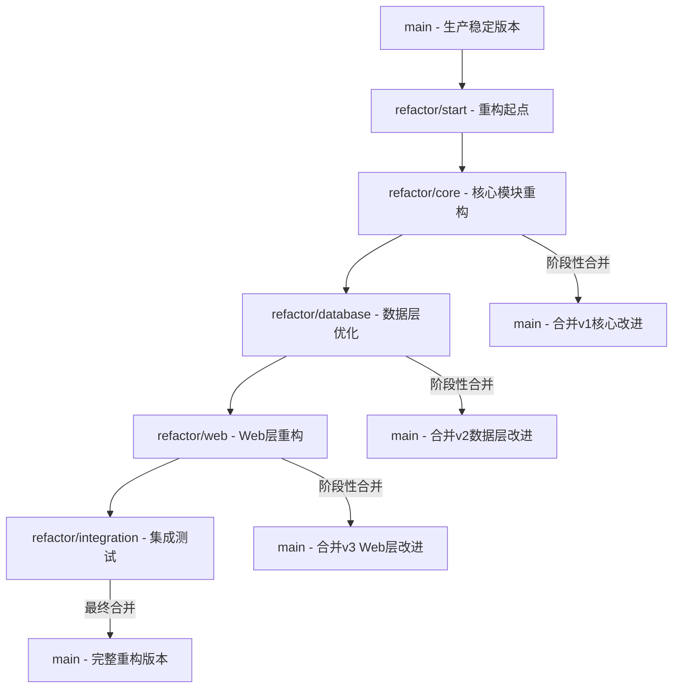
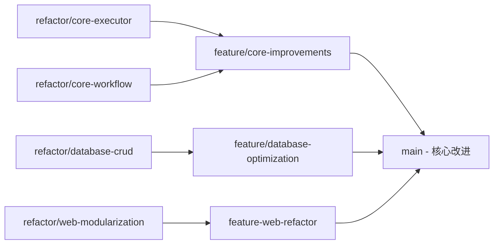

# VPSWeb 基于分支的重构策略

**制定日期**: 2025年11月2日
**策略**: Git分支并行重构，确保main分支稳定性

---

## 重构策略概述

### 🎯 核心思路
通过创建专门的**重构分支**，在隔离的环境中进行彻底的代码改造，不影响main分支的稳定运行。重构完成后，通过**分阶段合并**的方式将改进集成到主分支。

### 🌳 分支策略图



---

## 分支管理策略

### 🌿 分支命名规范

| 分支类型 | 命名规范 | 说明 |
|---------|---------|------|
| 重构主分支 | `refactor/main` | 重构工作的主分支 |
| 核心模块分支 | `refactor/core-executor` | Executor重构 |
| | `refactor/core-workflow` | Workflow重构 |
| 数据层分支 | `refactor/database-crud` | CRUD操作重构 |
| | `refactor/database-optimization` | 数据库优化 |
| Web层分支 | `refactor/web-modularization` | Web模块化 |
| | `refactor/web-api-v2` | API v2设计 |
| 测试分支 | `refactor/test-suite` | 测试套件完善 |
| 集成分支 | `refactor/integration-testing` | 集成测试 |

### 🔄 分支工作流程

```bash
# 1. 创建重构起点分支
git checkout -b refactor/start main
git push -u origin refactor/start

# 2. 基于起点创建各个功能分支
git checkout -b refactor/core-executor refactor/start
git checkout -b refactor/database-crud refactor/start
git checkout -b refactor/web-modularization refactor/start

# 3. 并行开发，定期同步
git checkout refactor/core-executor
git merge refactor/start  # 同步最新代码
```

---

## 阶段1: 准备阶段 (1周)

### 📋 任务清单

#### 1.1 建立重构基础

```bash
# 创建重构主分支
git checkout main
git pull origin main
git checkout -b refactor/main
git push -u origin refactor/main

# 设置分支保护规则 (在GitHub/GitLab中)
- 禁止直接push到main分支
- 要求PR必须通过CI/CD检查
- 要求代码审查
```

#### 1.2 完善测试基础设施

```bash
# 创建测试分支
git checkout refactor/main
git checkout -b refactor/test-suite

# 建立完整的测试覆盖
tests/
├── unit/                    # 单元测试
│   ├── test_executor.py
│   ├── test_workflow.py
│   ├── test_crud.py
│   └── test_parser.py
├── integration/             # 集成测试
│   ├── test_full_workflow.py
│   └── test_api_integration.py
├── fixtures/               # 测试数据
│   ├── sample_poems.json
│   └── expected_outputs.json
└── conftest.py             # pytest配置
```

**测试目标**: 覆盖率 > 85%，关键模块 > 95%

#### 1.3 建立CI/CD流水线

```yaml
# .github/workflows/refactor.yml
name: Refactor CI/CD

on:
  push:
    branches: [ refactor/* ]
  pull_request:
    branches: [ refactor/* ]

jobs:
  test:
    runs-on: ubuntu-latest
    steps:
      - uses: actions/checkout@v3
      - name: Set up Python
        uses: actions/setup-python@v4
        with:
          python-version: "3.11"

      - name: Install dependencies
        run: |
          pip install -e .
          pip install pytest pytest-cov black flake8 mypy

      - name: Run tests
        run: |
          pytest tests/ --cov=src/vpsweb --cov-report=xml

      - name: Code quality checks
        run: |
          black --check src/ tests/
          flake8 src/ tests/
          mypy src/
```

---

## 阶段2: 核心模块重构 (3-4周)

### 🎯 目标
重构executor.py和workflow.py，建立新的架构基础。

### 📋 实施策略

#### 2.1 Executor重构分支

```bash
# 创建Executor重构分支
git checkout refactor/main
git checkout -b refactor/core-executor

# 新的文件结构
src/vpsweb/core/
├── executor.py              # 保留原文件 (向后兼容)
├── executor_v2.py           # 新的Executor实现
├── retry_strategies.py      # 重试策略模块
├── parser_registry.py       # 解析器注册表
└── execution_context.py     # 执行上下文
```

**重构策略**: 保留原文件，创建新的V2版本

```python
# src/vpsweb/core/executor_v2.py
class StepExecutorV2:
    """重构后的StepExecutor - 模块化、可测试、可扩展"""

    def __init__(self, llm_factory: LLMFactory, prompt_service: PromptService):
        self.llm_factory = llm_factory
        self.prompt_service = prompt_service
        self.parser_registry = ParserRegistry()
        self.retry_strategy = ExponentialBackoffRetry()

    async def execute_step(self, step_name: str, input_data: Dict[str, Any], config: StepConfig) -> Dict[str, Any]:
        # 使用新的编排器模式
        pass

# src/vpsweb/core/executor.py (保持向后兼容)
class StepExecutor:
    """原有的StepExecutor - 保持向后兼容"""

    async def execute_step(self, step_name: str, input_data: Dict[str, Any], config: StepConfig) -> Dict[str, Any]:
        # 可以选择使用新实现或原实现
        return await self._execute_with_new_or_legacy(step_name, input_data, config)
```

#### 2.2 Workflow重构分支

```bash
# 创建Workflow重构分支
git checkout refactor/main
git checkout -b refactor/core-workflow

# 新的文件结构
src/vpsweb/core/
├── workflow.py              # 保留原文件
├── workflow_v2.py           # 新的Workflow实现
├── workflow_config.py       # 配置驱动的工作流
├── workflow_orchestrator.py # 工作流编排器
└── progress_manager.py      # 进度管理器
```

#### 2.3 测试和验证

```python
# tests/integration/test_refactored_core.py
@pytest.mark.asyncio
async def test_executor_v2_backward_compatibility():
    """确保新Executor与现有代码兼容"""
    # 测试新旧实现输出一致

@pytest.mark.asyncio
async def test_workflow_v2_config_driven():
    """测试新Workflow的配置驱动能力"""
    # 测试通过YAML配置定义工作流
```

#### 2.4 阶段性合并策略

```bash
# 当核心模块重构完成后，准备合并到main
git checkout main
git checkout -b feature/refactor-core-v1
git merge refactor/core-executor
git merge refactor/core-workflow

# 创建PR，进行代码审查
# 审查通过后合并到main分支
```

---

## 阶段3: 数据层重构 (2-3周)

### 🎯 目标
重构CRUD操作，优化数据库性能。

### 📋 实施策略

#### 3.1 数据层重构分支

```bash
# 创建数据层重构分支
git checkout refactor/main
git checkout -b refactor/database-crud

# 新的文件结构
src/vpsweb/repository/
├── crud.py                  # 保留原文件
├── crud_v2/                 # 新的CRUD实现
│   ├── __init__.py
│   ├── base.py             # CRUDBase抽象类
│   ├── poem_crud.py        # 新的Poem CRUD
│   ├── translation_crud.py # 新的Translation CRUD
│   └── id_generator.py     # ID生成器
├── migrations/              # 数据库迁移
└── optimization/            # 查询优化
    ├── indexes.py          # 索引定义
    └── query_optimizer.py  # 查询优化器
```

#### 3.2 数据库迁移策略

```python
# 创建向后兼容的迁移脚本
class MigrationManager:
    def __init__(self, db: Session):
        self.db = db

    async def migrate_incremental(self):
        """增量式数据迁移，不影响现有功能"""
        # 1. 创建新的表结构
        # 2. 逐步迁移数据
        # 3. 更新应用配置
        # 4. 切换到新实现
        # 5. 清理旧结构
```

#### 3.3 性能基准测试

```python
# tests/performance/test_database_performance.py
def test_crud_v2_performance():
    """对比新旧CRUD实现的性能"""
    # 测试查询速度
    # 测试并发性能
    # 测试内存使用
```

---

## 阶段4: Web层重构 (3-4周)

### 🎯 目标
拆分main.py的巨大文件，实现模块化架构。

### 📋 实施策略

#### 4.1 Web层重构分支

```bash
# 创建Web层重构分支
git checkout refactor/main
git checkout -b refactor/web-modularization

# 新的文件结构
src/vpsweb/webui/
├── main.py                  # 保留原文件
├── main_v2.py              # 新的应用入口
├── config/                 # 配置模块
├── middleware/             # 中间件
├── dependencies/           # 依赖注入
├── exceptions/             # 异常处理
├── api/                    # API路由
├── pages/                  # 页面路由
└── services/               # 业务服务
```

#### 4.2 API版本控制

```python
# 实现API版本控制
# src/vpsweb/webui/api/
├── __init__.py
├── v1/                     # 保持现有API
│   └── poems.py           # 现有实现
└── v2/                     # 新版本API
    └── poems.py           # 新实现

# 路由配置
app.include_router(v1_router, prefix="/api/v1")
app.include_router(v2_router, prefix="/api/v2")
```

---

## 阶段5: 集成和测试 (2周)

### 🎯 目标
全面测试重构后的系统，确保完整性和性能。

### 📋 实施策略

#### 5.1 集成测试分支

```bash
# 创建集成测试分支
git checkout refactor/main
git checkout -b refactor/integration-testing

# 合并所有重构分支
git merge refactor/core-executor
git merge refactor/core-workflow
git merge refactor/database-crud
git merge refactor/web-modularization
```

#### 5.2 端到端测试

```python
# tests/e2e/test_full_translation_workflow.py
@pytest.mark.asyncio
async def test_complete_translation_workflow():
    """测试完整的翻译工作流程"""
    # 测试从输入到输出的完整流程
    # 验证所有步骤都正常工作
    # 确保性能符合预期
```

#### 5.3 性能对比测试

```python
# tests/performance/test_before_after.py
def test_performance_comparison():
    """对比重构前后的性能"""
    # API响应时间对比
    # 数据库查询效率对比
    # 内存使用对比
    # 并发处理能力对比
```

---

## 分支合并策略

### 🔄 阶段性合并流程



#### 合并策略步骤

1. **创建功能分支**
```bash
git checkout main
git checkout -b feature/refactor-core-improvements
git merge refactor/core-executor
git merge refactor/core-workflow
```

2. **全面测试**
```bash
# 在功能分支上运行完整测试套件
pytest tests/ --cov=src/vpsweb
# 运行性能测试
python -m tests.performance.benchmarks
```

3. **代码审查**
- 创建Pull Request到main分支
- 至少2名资深开发者审查
- 自动化CI/CD检查通过

4. **渐进式部署**
```bash
# 合并到main分支
git checkout main
git merge feature/refactor-core-improvements
git tag -a "v0.4.0-core-refactor" -m "Core module refactoring"
```

---

## 风险控制和质量保证

### 🛡️ 风险控制措施

1. **分支隔离**: 重构工作完全在独立分支进行
2. **向后兼容**: 保留原有接口和实现
3. **渐进合并**: 分阶段将改进集成到主分支
4. **全面测试**: 每个合并点都有完整的测试验证

### 📊 质量检查清单

#### 代码质量
- [ ] 代码覆盖率 > 85%
- [ ] 单个方法长度 < 50行
- [ ] 圈复杂度 < 10
- [ ] 无代码重复 (< 3%)

#### 性能要求
- [ ] API响应时间不增加
- [ ] 数据库查询效率提升 ≥ 20%
- [ ] 内存使用优化 ≥ 10%

#### 功能完整性
- [ ] 所有现有功能正常工作
- [ ] 新功能按设计要求实现
- [ ] API向后兼容

### 🚨 回滚策略

```bash
# 如果合并后出现问题，可以快速回滚
git checkout main
git revert <merge-commit-hash>
git tag -a "v0.3.12-rollback" -m "Rollback core refactor"

# 或者回滚到上一个稳定版本
git checkout v0.3.11
git checkout -b hotfix/fix-refactor-issues
```

---

## 时间规划和里程碑

| 阶段 | 分支 | 时间 | 主要目标 | 里程碑 |
|------|------|------|---------|--------|
| 准备 | `refactor/test-suite` | 1周 | 测试基础设施 | 覆盖率>85% |
| 核心重构 | `refactor/core-*` | 3-4周 | Executor/Workflow重构 | 核心模块改进合并 |
| 数据层 | `refactor/database-*` | 2-3周 | CRUD重构优化 | 数据层改进合并 |
| Web层 | `refactor/web-*` | 3-4周 | Web模块化 | Web层改进合并 |
| 集成 | `refactor/integration` | 2周 | 全面测试集成 | 完整重构版本 |

**总时间**: 11-14周 (约3-3.5个月)

---

## 团队协作流程

### 👥 角色分工

- **主架构师**: 负责重构分支的整体设计和技术决策
- **核心开发者**: 负责各功能分支的具体实现
- **测试工程师**: 负责测试策略和质量保证
- **DevOps工程师**: 负责CI/CD和部署流程

### 🔄 协作机制

1. **每日同步**: 各分支开发者同步进度
2. **周度评估**: 评估各分支状态和风险
3. **里程碑评审**: 每个阶段完成后的成果验收
4. **合并决策**: 基于测试结果和业务需求决定合并时机

---

## 成功标准

### ✅ 技术目标

1. **代码质量**
   - 测试覆盖率 > 85%
   - 代码复杂度降低30%
   - 模块耦合度显著降低

2. **性能提升**
   - API响应时间优化 ≥ 15%
   - 数据库查询效率提升 ≥ 25%
   - 内存使用优化 ≥ 15%

3. **可维护性**
   - 新功能开发效率提升 ≥ 40%
   - Bug修复时间减少 ≥ 50%
   - 代码审查效率提升 ≥ 30%

### ✅ 业务目标

1. **零业务影响**: 重构过程不影响正常运行
2. **功能完整性**: 所有现有功能保持正常
3. **扩展能力**: 支持新的业务需求
4. **团队效率**: 提升开发团队的工作效率

通过这个基于Git分支的重构策略，可以在确保main分支稳定的前提下，进行彻底的代码重构，同时通过阶段性的合并将改进逐步集成到生产系统中。